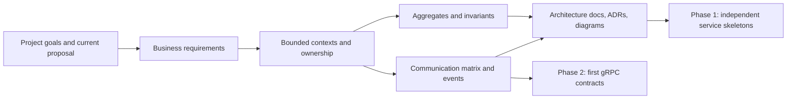

# Phase 0: Domain Discovery and Architecture

## Status

**In Progress.** `plans/project_plan.md` already contains an initial project goal, candidate bounded contexts, example service ownership, communication patterns, aggregate sketches, and the Phase 0 checklist. The repository does not yet contain validated, project-specific domain artifacts: `docs/architecture/README.md` is an outline, and there are no context-map, requirements, domain-model, communication-matrix, or workflow documents. There is no service implementation to verify against.

## Objective

Turn the initial architecture proposal into an internally consistent, reviewable domain foundation. The outputs must give Phase 1 stable service boundaries and give Phase 2 clear communication responsibilities, without implementing service skeletons, APIs, or infrastructure in this phase.

## Scope

- Capture the target customer, core business goals, key user journeys, business rules, constraints, and explicit non-goals.
- Validate the bounded contexts and the proposed mapping from contexts to services.
- Define ownership boundaries, context relationships, key aggregates and invariants, and domain events at a conceptual level.
- Produce a service communication matrix that identifies caller, target, interaction, reason, and whether the interaction needs an immediate response or can be asynchronous.
- Produce architecture diagrams and record decisions in the ADR format already present under `docs/adr/`.
- Prepare an architecture handoff that Phase 1 can use to create the service skeletons and Phase 2 can use to design its first gRPC contracts.

## Out of Scope

- Creating or implementing any of the 13 Spring Boot service skeletons; that belongs to Phase 1.
- Defining or generating `.proto` contracts, generated Java stubs, or a working gRPC call; those belong to Phase 2.
- Implementing persistence schemas, Kafka topics, Redis behavior, AI/RAG, deployments, or observability.
- Treating every technology choice in the overall plan as an accepted decision without recording alternatives and trade-offs.

## Inputs and Dependencies

- **Current input:** [`../project_plan.md`](../project_plan.md), especially its project goal, monorepo strategy, bounded-context table, service-ownership and communication sections, domain-model sketches, Phase 0–2 descriptions, and ADR register.
- **Current documentation scaffolding:** `docs/architecture/README.md`, `docs/diagrams/README.md`, `docs/adr/README.md`, and `docs/adr/000-template.md`.
- **Predecessor:** None. The repository's current plan is the starting proposal, not evidence that domain discovery has been completed.
- **Successor: Phase 1.** Phase 1 needs a reviewed list of service names and boundaries, one owner per service, and an agreed rule that services do not directly access each other's data.
- **Successor: Phase 2.** Phase 2 needs the initial caller/target pairs, operation purpose, and interaction style for customer, product, and inventory contracts. The exact schemas and RPC behavior remain Phase 2 work.

## Work Plan

### 1. Establish the business scope

Review the project's interview-preparation goal and the architecture already proposed in the overall plan. Write concise requirements and representative journeys for the product/catalog, customer, cart, order, inventory, payment, fulfillment, search, and analytics areas. Record assumptions, terminology, business rules, quality attributes, and explicit non-goals. Keep requirements small enough to explain and implement incrementally; this is not a specification for a full commercial marketplace.

**Deliverable:** `docs/architecture/business-requirements.md`.

**Acceptance:** A reader can identify the intended users, core journeys, essential business rules, and project non-goals without relying on unstated assumptions.

### 2. Validate bounded contexts and ownership

Use the candidate contexts in the overall plan as hypotheses. For each context, identify its responsibility, vocabulary, owned data, important inbound/outbound relationships, and the reason it is or is not a deployable service. Resolve overlap explicitly, especially around product discovery versus product catalog, identity versus customer profile, and payment versus order workflow. Preserve the plan's warning not to create services only to increase service count.

**Deliverables:** `docs/architecture/bounded-contexts.md` and `docs/architecture/context-map.md`.

**Acceptance:** Every proposed service has one primary context and a concise ownership statement; no service reads or writes another service's private database; context relationships have named responsibilities and direction.

### 3. Define core domain concepts

Review the aggregate sketches already in the overall plan. For each core aggregate in Phase 0 scope, record its purpose, identity, owned entities/value objects, invariants, and the commands or events that change it. Start with Product, Cart, Order, Inventory Item, and Payment. Include Customer only to the level required by customer ownership and order validation. Keep schemas, table design, and detailed service APIs out of scope.

**Deliverables:** `docs/architecture/domain-model.md` and `docs/architecture/glossary.md`.

**Acceptance:** Aggregate boundaries have explicit invariants and ownership; terms are used consistently across requirements, context map, and communication matrix; unresolved modeling questions are listed rather than silently decided.

### 4. Map communication and domain events

Build a communication matrix from actual use cases. For each interaction, record caller, target, business purpose, synchronous/asynchronous need, candidate mechanism, data exchanged at a conceptual level, and failure/consistency considerations. Use gRPC for a required immediate answer and Kafka for notifications that consumers can process asynchronously, as directed by the overall plan. Identify candidate domain/integration events and their owning context; do not define serialization schemas or operational topic configuration here.

**Deliverables:** `docs/architecture/communication-matrix.md` and `docs/architecture/domain-events.md`.

**Acceptance:** Every cross-context interaction has an owner and reason; the matrix supports Phase 2's customer/product/inventory contract selection; event names and ownership agree with the context map; no interaction depends on direct cross-service database access.

### 5. Record architectural decisions and diagrams

Use the existing ADR template for decisions actually evaluated in this phase. Review the ADR topics listed in the overall plan, capture alternatives and trade-offs, and distinguish accepted decisions from proposals. A later-phase technology decision must not be marked accepted solely because the technology appears in the roadmap; either justify it with current evidence or leave it proposed for review when its implementation phase approaches. Create a context map and a high-level system/context diagram, keeping editable diagram sources in `docs/diagrams/` where useful.

**Deliverables:** Relevant ADRs under `docs/adr/`, plus `docs/diagrams/context-map.mmd` and `docs/diagrams/system-context.mmd` (or equivalent Mermaid sources).

**Acceptance:** Every accepted decision has context, alternatives, rationale, and consequences; deferred decisions are visibly proposed; diagrams agree with the ownership and communication documents and render as valid Mermaid.

### 6. Review and hand off to later phases

Cross-check the documents against one another and the overall plan. Resolve contradictions or explicitly record open questions with an owner and the phase in which they must be resolved. Review the handoff with the Phase 1 service inventory and Phase 2's first gRPC contracts in view. Update `docs/architecture/README.md` to link to the completed artifacts.

**Acceptance:** Phase 1 can scaffold the agreed services without redefining their responsibilities; Phase 2 can select its first contracts without inventing caller/target relationships; all open questions have an explicit disposition.

## Architecture Flow

This diagram shows Phase 0 outputs flowing into the next two phases. It is a planning boundary, not a claim that these artifacts or services already exist.

## Risks and Decisions to Resolve

- The overall plan contains candidate boundaries and domain sketches, but no repository evidence that they have been validated. Treat them as proposals until reviewed.
- The project includes many bounded contexts; trying to model every edge case now risks turning a learning project into a broad specification. Keep Phase 0 focused on the first end-to-end learning paths and stable ownership boundaries.
- Payment communication is explicitly left as Kafka/gRPC depending on workflow in the overall plan. Record the workflow and trade-off before accepting a decision; do not choose a transport by default.
- Redis, Cassandra, RAG/vector storage, Kubernetes, Helm, and observability decisions may require later-phase evidence. Keep those ADRs proposed or defer their acceptance rather than implying implementation.
- Phase 1 independently deployable skeletons still need a shared build strategy. Phase 0 should establish module ownership and the monorepo principle, while concrete Maven configuration remains Phase 1.

## Completion Criteria

- All deliverables in the task list exist and are linked from the architecture documentation index.
- The bounded-context list and service ownership are reviewed and consistent with the Phase 1 service inventory.
- Core aggregates have agreed responsibilities and invariants; open modeling questions are recorded.
- The communication matrix and event ownership support Phase 2's initial contract scope.
- ADR statuses are honest and their reasoning is documented; diagrams are valid and consistent with the text.
- A final review finds no unresolved contradiction that would force Phase 1 or Phase 2 to invent a domain boundary.

## References

- [Overall project plan](../project_plan.md)
- [Phase task tracker](tasks.md)
- [Architecture documentation index](../../docs/architecture/README.md)
- [ADR template](../../docs/adr/000-template.md)
